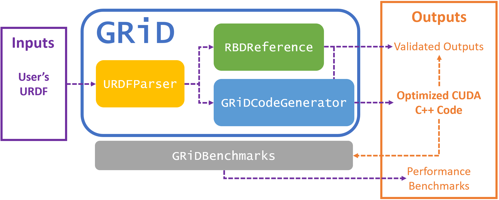

# GRiD
[](#contributors)
[](https://github.com/A2R-Lab/GRiD/actions/workflows/gh-pages.yml)

A GPU-accelerated library for computing rigid body dynamics with analytical gradients.

GRiD wraps our [URDFParser](https://github.com/robot-acceleration/URDFParser), [GRiDCodeGenerator](https://github.com/robot-acceleration/GRiDCodeGenerator), and [RBDReference](https://github.com/robot-acceleration/RBDReference) packages. Using its scripts, users can easily generate and test optimized rigid body dynamics CUDA C++ code for their URDF files.

For additional information and links to our paper on this work, check out our [project website](https://brianplancher.com/publication/GRiD).

**This package contains submodules make sure to run ```git submodule update --init --recursive```** after cloning!



## Quick Start

Install (creates a local venv and registers the `grid-generate` CLI):
```shell
bash base_install.sh
source .venv/bin/activate
```

Generate CUDA code for your robot:
```shell
# Via the installed CLI:
grid-generate path/to/robot.urdf [-t EE_JOINT_NAME] [-n NAMESPACE] [-f]

# Or via a hardcoded zero-config example:
python examples/quickstart_iiwa14.py       # iiwa14 fixed base
python examples/quickstart_go2_floating.py # Go2 floating base
```

Validate and debug:
```shell
# Print CPU reference values for all algorithms:
python examples/print_reference_values.py path/to/robot.urdf

# Compile and run the CUDA print kernel (requires nvcc):
python examples/print_grid.py path/to/robot.urdf
```

> **Requires a C++17-capable host compiler** (e.g., g++ ≥ 7, clang++ ≥ 5).
> The benchmark and codegen runtime compile with `-std=c++17` — needed for
> inline variables in the bench common header.

## Usage
+ `grid-generate PATH_TO_URDF` — generate `grid.cuh`; add `-d` for full debug mode, `-f` for floating base, `-t JOINT_NAME` to target a specific end-effector joint
+ `python examples/print_reference_values.py PATH_TO_URDF` — print CPU reference values for all algorithms to validate CUDA output
+ `python examples/print_grid.py PATH_TO_URDF` — compile and run the CUDA print kernel against the generated header

## Floating-Base Conventions
Floating-base parsing and the Python reference path now accept a public
floating-base convention flag. The default is Pinocchio-compatible:

+ `floating_base_convention="pinocchio"`:
  `q = [x, y, z, qx, qy, qz, qw]`,
  `v = [vx, vy, vz, wx, wy, wz]`
+ `floating_base_convention="legacy"`:
  `q = [x, y, z, qw, qx, qy, qz]`,
  `v = [wx, wy, wz, vx, vy, vz]`

GRiD normalizes both public conventions into one shared internal floating-base
representation, so the code generator and `RBDReference` stay consistent under
the hood while callers can choose the input/output ordering they need.

## Developer Testing
The Pinocchio-side floating convention regression suite exercises both public
floating-base orderings across the current floating robot manifest:

```bash
.venv/bin/python -m pytest test/pinocchio_equivalents/tests/test_floating_base_conventions.py -q
```

The CUDA executable equivalence suite still defaults to the Pinocchio-facing
floating convention and is currently being expanded from the first floating-base
smoke slice to broader floating algorithm coverage.

For floating CUDA development, the pytest harness also accepts optional env
overrides:

+ `GRID_CUDA_FLOATING_ALGORITHMS=all` to try the broader floating candidate set
+ `GRID_CUDA_FLOATING_ALGORITHMS=inverse_dynamics,forward_dynamics` to request a subset
+ `GRID_CUDA_FLOATING_SAMPLE_NAMES=all` to run every deterministic/random sample instead of only `zero`

Generated CUDA defaults to a 96 KiB dynamic shared-memory target
(`GRID_CUDA_TARGET_SHARED_MEM_BYTES=98304`) and selects spill fallbacks only
when the generated arena would exceed that target. See
[`docs/source/user_guide/tutorials/cuda_validation.rst`](docs/source/user_guide/tutorials/cuda_validation.rst)
for shared-memory target overrides, L2 controls, and the recommended
ptxas/register-pressure analysis workflow for tuning a specific robot/GPU.

## Current Support
GRiD currently fully supports any robot model consisting of revolute, prismatic, and fixed joints that does not have closed kinematic loops.

GRiD currently implements the following rigid body dynamics algorithms:
+ Inverse Dynamics via the Recursive Newton Euler Algorithm (RNEA) from [Featherstone](https://link.springer.com/book/10.1007/978-1-4899-7560-7)
+ Composite Rigid Body Algorithm (CRBA) for the joint-space mass matrix and the Articulated Body Algorithm (ABA) for forward dynamics, both from [Featherstone](https://link.springer.com/book/10.1007/978-1-4899-7560-7)
+ The Direct Inverse of Mass Matrix from [Carpentier](https://www.researchgate.net/publication/343098270_Analytical_Inverse_of_the_Joint_Space_Inertia_Matrix)
+ Forward Dynamics by combining the above algorithms as qdd = -M^{-1}(u-RNEA(q,qd,0))
+ Analytical Gradients of Inverse Dynamics from [Carpentier](https://hal.archives-ouvertes.fr/hal-01790971)
+ Analytical Gradient of Forward Dynamics from [Carpentier](https://hal.archives-ouvertes.fr/hal-01790971)
+ End-effector pose, pose gradient (Jacobian), and pose Hessian
+ Second-Order Inverse Dynamics (IDSVA-SO) from [Singh, Russell, & Wensing](https://arxiv.org/abs/2302.06001) — both body-frame and world-frame variants. A codegen-time dispatcher picks body-frame for fixed-base (multi-pass amortizes, ~30× faster) and world-frame for floating-base (single-pass + no gravity shim, 2–4× faster)
+ Second-Order Forward Dynamics (FDSVA-SO) from [Singh, Russell, & Wensing](https://arxiv.org/abs/2302.06001) on both fixed and floating bases

Additional algorithms and features are in development. If you have a particular algorithm or feature in mind please let us know by posting a GitHub issue. We'd also love your collaboration in implementing the Python reference implementation of any algorithm you'd like implemented!

## C++ API
For each algorithm GRiD emits four layers: `*_inner` (core math on
shared-mem inputs), `*_device` (allocates scratch + calls `_inner`),
`*_kernel` (global entry point with batched timestep loop), and the
host wrapper (CPU launcher with H↔D copies). See the
[codegen architecture docs](docs/source/user_guide/concepts/codegen_architecture.rst)
for the rationale and concrete signatures.

## Citing GRiD
To cite GRiD in your research, please use the following bibtex for our paper ["GRiD: GPU-Accelerated Rigid Body Dynamics with Analytical Gradients"](https://brianplancher.com/publication/grid/):
```
@inproceedings{plancher2022grid,
  title={GRiD: GPU-Accelerated Rigid Body Dynamics with Analytical Gradients}, 
  author={Brian Plancher and Sabrina M. Neuman and Radhika Ghosal and Scott Kuindersma and Vijay Janapa Reddi},
  booktitle={IEEE International Conference on Robotics and Automation (ICRA)}, 
  year={2022}, 
  month={May}
}
```

## Performance
When performing multiple computations of rigid body dynamics algorithms, GRiD provides as much as a 7.6x speedup over a state-of-the-art, multi-threaded CPU implementation, and maintains as much as a 2.6x speedup when accounting for I/O overhead. 


To learn more about GRiD's performance results and to run your own benchmark analysis please see [`test/benchmarks/`](test/benchmarks/) and our [paper](https://brianplancher.com/publication/GRiD/).

## Installation
The Quick Start above covers the common-case install. For CUDA Toolkit
setup, developer dependencies (Pinocchio, robot_descriptions, benchmarks),
and Docker, see the full
[installation guide](docs/source/user_guide/getting_started/installation.rst).

## Troubleshooting

### Bench harness `nvcc` hangs on floating-base kernels (sm_8x)

On Ampere (sm_86 / CUDA 12.6) the bench harness can wedge `nvcc` /
`ptxas` at 100 % CPU when compiling heavy floating-base GRiD harnesses.
Pass `--ptxas-opt-level 2` to `test/benchmarks/run_multi_version.py` or
the per-robot `test/benchmarks/baselines/grid/run.py` — it forwards
`-Xptxas -O2` to floating-base compiles only. Blackwell (sm_120) does
not hit this. Typical user code that includes `grid.cuh` and calls the
batch host wrappers (e.g. `grid::forward_dynamics<T>(...)`) does not
trigger the hang — it's specific to the timing-bench template surface.


## Contributors

<!-- ALL-CONTRIBUTORS-LIST:START - Do not remove or modify this section -->
<!-- prettier-ignore-start -->
<!-- markdownlint-disable -->
<table>
  <tbody>
    <tr>
      <td align="center" valign="top" width="20%"><a href="https://github.com/kawotwi"><br /><sub><b>Kwamena A</b></sub></a><br /></td>
      <td align="center" valign="top" width="20%"><a href="https://github.com/plancherb1"><br /><sub><b>Brian Plancher</b></sub></a><br /></td>
      <td align="center" valign="top" width="20%"><a href="https://github.com/Z4KH"><br /><sub><b>Zachary Pestrikov</b></sub></a><br /></td>
      <td align="center" valign="top" width="20%"><a href="https://github.com/harvard-edge/cs249r_book/graphs/contributors"><br /><sub><b>Danelle Tuchman</b></sub></a><br /></td>
      <td align="center" valign="top" width="20%"><a href="https://github.com/anncli"><br /><sub><b>Ann Li</b></sub></a><br /></td>
    </tr>
    <tr>
      <td align="center" valign="top" width="20%"><a href="https://github.com/naren-loganathan"><br /><sub><b>Naren Loganathan</b></sub></a><br /></td>
      <td align="center" valign="top" width="20%"><a href="https://github.com/EmreAdabag"><br /><sub><b>EmreAdabag</b></sub></a><br /></td>
      <td align="center" valign="top" width="20%"><a href="https://github.com/emilyburnett2003"><br /><sub><b>emilyburnett2003</b></sub></a><br /></td>
      <td align="center" valign="top" width="20%"><a href="https://github.com/pruyontrarakk"><br /><sub><b>pruyontrarakk</b></sub></a><br /></td>
    </tr>
  </tbody>
</table>

<!-- markdownlint-restore -->
<!-- prettier-ignore-end -->

<!-- ALL-CONTRIBUTORS-LIST:END -->
