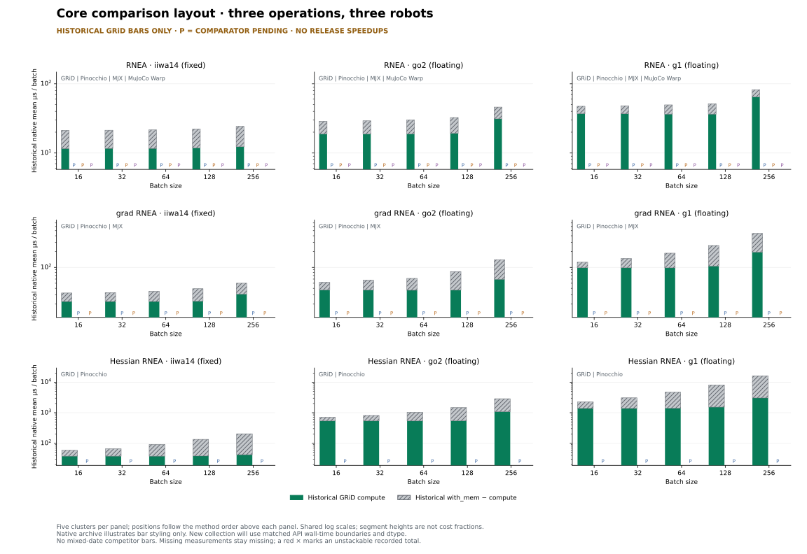
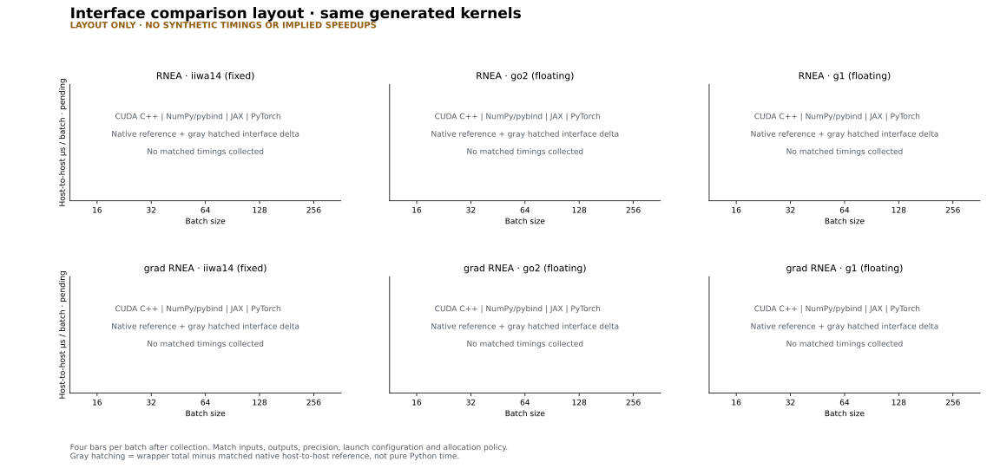
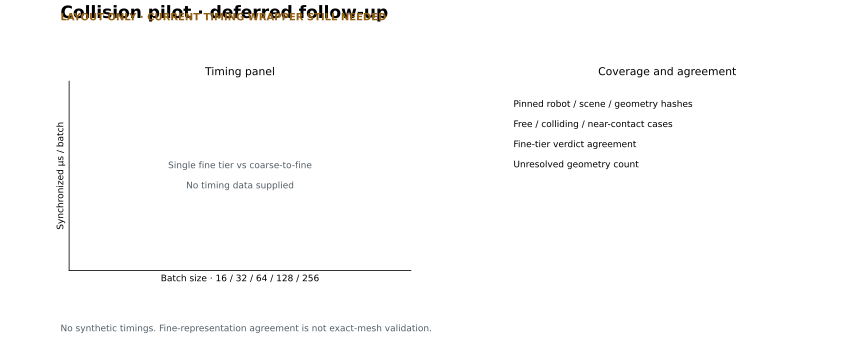

Plot design previews
====================

**Design review only, not release results.** The main figure uses historical
GRiD values to preview clustered-bar styling; comparator positions remain
pending. The wrapper and collision sketches have no fabricated timings. The
:doc:`release_measurements` page specifies the comparison set and collection
gates. The previous resident-rollout design is dropped.

.. _core-design:

Core comparison — Clustered bars and gray hatched overhead
------------------------------------------------------------------------

Rows are operations, columns are robots, and each panel contains five batch
clusters. Order the methods consistently, keeping GRiD first. The headline
comparison set is GRiD/Pinocchio/MJX/MuJoCo Warp for RNEA, GRiD/Pinocchio/MJX
for grad RNEA, and GRiD/analytical Pinocchio for Hessian RNEA. The Hessian
comparison is not a claim that every other library lacks second derivatives.

This preview shows **only historical native GRiD bars**, not a competitive
result. Old competitor captures differ in date, model/precision and timing
contracts; mixing them into a release-looking comparison would be misleading.
``P`` marks an uncollected comparator slot and has no quantitative height.
Method counts differ by row. Use a shared log scale within each row; the full
table below the eventual figures will carry exact values and status reasons.

The native archive uses recorded compute/with-memory means from RTX 5090
captures. Hatching is their nonnegative difference. An unstackable total is
shown as a red cross, never silently clamped. These historical boundaries are
**not** the final protocol: the new bars will show resident API wall time plus
the paired incremental host-to-host cost. CPU bars have no GPU-transfer cap.
Default to fp32, with the current fp64 Pinocchio analytical Hessian path labeled
explicitly and footnoted as a mixed-precision comparison.
Show error bars and speedup annotations only after matched collection.

.. _workflow-design:

Interface comparison — RNEA and grad RNEA
------------------------------------------------------------------------

All interfaces use matched host inputs and outputs for the primary bars. The
gray hatched wrapper cap is the incremental cost over the same native full-call
reference, not pure Python execution time. Resident JAX/PyTorch measurements go
in the table as a separate boundary. Existing JAX-only timings do not establish
a fair four-interface comparison, so this preview deliberately has no heights.

.. _collision-design:

Deferred collision design
--------------------------

Use matched fine geometry to compare single-tier and coarse-to-fine checks,
with coverage/agreement next to latency. This needs a current timing wrapper
and is not on the critical path for either main figure.

Provenance and reproduction
---------------------------

The tracked :download:`historical native excerpt <_static/release-preview/historical-excerpt.json>`
contains values, source JSON keys, original capture paths, SHA-256s and available
metadata. It does not restore missing revision/dtype provenance. The
:download:`plot manifest <_static/release-preview/manifest.json>` records input,
script and output hashes. No autotune-minimum field is substituted for a timing.
The original parser's median field copied the average; these previews read mean.

From the repository root, with Matplotlib and NumPy installed:

.. code-block:: shell

   python docs/plot_release_previews.py

This regenerates SVG/PNG from the tracked excerpt on the CPU.
``--import-existing`` refreshes it from six named historical native captures.
Neither mode compiles CUDA or runs a GPU benchmark. Ordinary Sphinx builds use
the checked-in assets and need neither Matplotlib nor the original captures.
