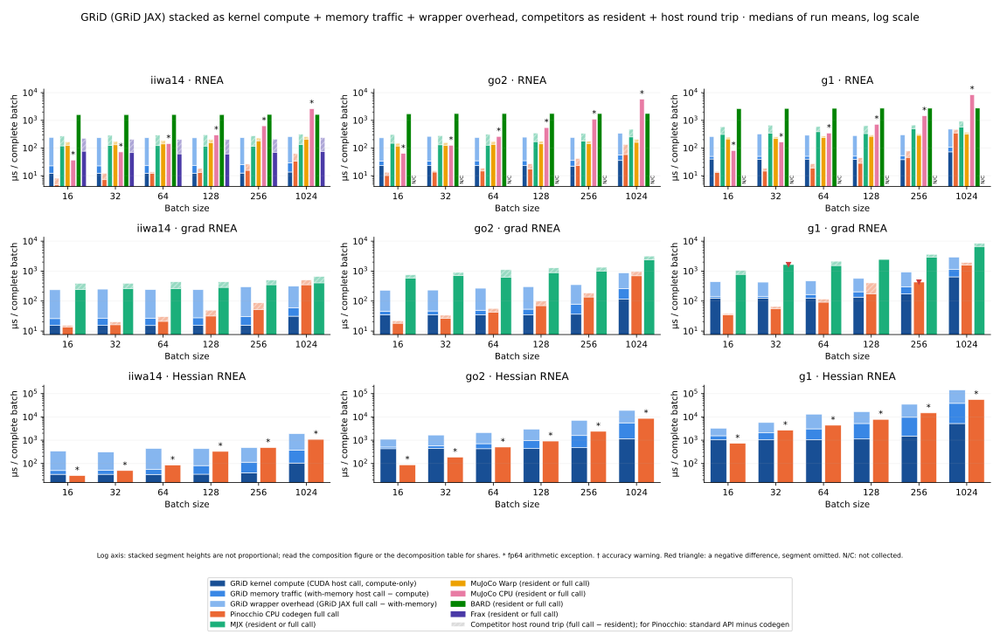
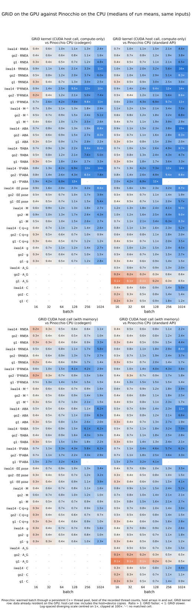
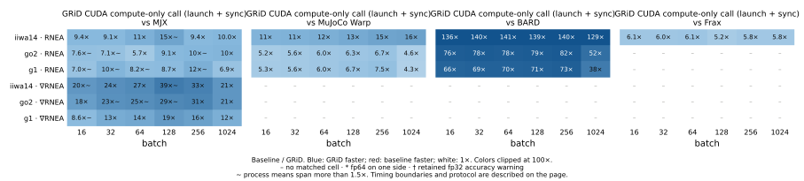
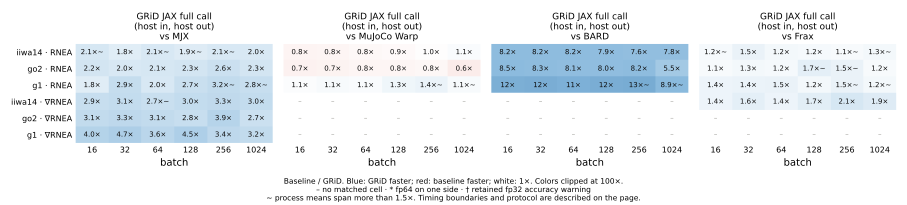

Release measurements
====================

Every number on this page comes from one audited collection on one machine
(NVIDIA RTX 5090, fp32 everywhere except where marked, 26 September 2026,
``modernizing-tests`` branch). Three robots — **iiwa14** (fixed base, 7 joints),
**go2** (floating base, 18 velocities) and **G1** (floating base, 43 velocities) —
fifteen operations, batch sizes 16 to 1024, GRiD through every one of its
surfaces beside Pinocchio, MJX, MuJoCo Warp, MuJoCo CPU, BARD and Frax. Each
cell was validated against an independent fp64 Pinocchio oracle before and after
timing; a cell that failed validation has no bar. The collector, its protocol
and the raw captures are in ``test/benchmarks/release/`` (see its ``README.md``).

The short version, stated the way the data says it:

* **Kernel against kernel, GRiD leads.** With inputs and outputs resident on
  the device, GRiD's generated kernels are faster than MJX on every measured
  cell (1–30×, most cells 5–20×), faster than MuJoCo Warp on the dynamics
  operations (2–17×), faster than BARD by 14–160× and faster than Frax by 4–7×,
  at every batch size up to 1024.
* **We do not always win.** End-effector pose on the floating-base robots is
  a tiny kernel and MuJoCo Warp's is faster (GRiD at 0.4–0.9× of Warp, kernel
  to kernel; 0.3–0.6× through the JAX API). On G1 at batch 1024 the ABA and
  mass-matrix kernels are at parity with Warp. Through the JAX API's complete
  call (host arrays in and out) GRiD still beats MJX and BARD on nearly every
  cell, but is at parity or behind Warp on the first-order operations, because
  Warp's host round trip is cheaper than JAX's, and trades cells with Frax.
* **Against Pinocchio, the boundary and the batch decide.** Pinocchio's
  code-generated C++ on eight CPU threads wins nearly every cell below batch
  64. With the data already on the GPU, GRiD's kernel is 1.2–14× faster at
  batch 1024 on every operation Pinocchio code-generates; including the
  host↔device copies, GRiD's CUDA host call reaches parity around batch 128–256
  and 0.7–6× at 1024 (most cells above 1×; the floating-base bias vector and
  G1's mass matrix stay just below parity).
  GRiD's JAX and PyTorch full calls add a framework round trip of roughly
  150–200 µs and lose to Pinocchio's codegen at small batch, reaching parity
  only at the largest batches. Most users call Pinocchio's standard templated
  API, which measured about twice the code-generated time; both are shown.
  Pinocchio's centroidal momentum matrix beats GRiD's host call on the floating
  robots at every batch (0.1–0.6×).

Figure 1 — Where the time goes
------------------------------

time plus a hatched standard-API cap. Log axis, batches 16 to 1024.
   :target: _static/release/stacked_core.svg

Absolute microseconds per complete batch, log axis. GRiD is the blue stack: the
generated kernel's compute-only time (CUDA host call), the host↔device memory
traffic on top (with-memory host call minus compute), and the JAX API's own
overhead on top of that (full call minus with-memory). Each GPU competitor is
its resident evaluation plus a hatched cap for its host round trip; Pinocchio
CPU is its code-generated time plus a hatched cap for the standard API. Every
segment is a difference of two measured medians on the same cell; a negative
difference is marked, never clamped. ``*`` marks fp64 arithmetic, ``†`` a
retained fp32 accuracy warning (see below). The same figure for all fifteen
operations: :download:`stacked_all.svg <_static/release/stacked_all.svg>`.

Figure 2 — Speedup against Pinocchio (CPU)
-------------------------------------------

Ratio of Pinocchio's warmed batch time to GRiD's, blue when GRiD is faster, red
when Pinocchio is. The top row is the kernel with data already on the GPU (the
situation inside a GPU optimiser); the bottom row includes the copies in and
out. Pinocchio runs a persistent C++ thread pool and the best of the recorded
thread counts (1, batch/16, 8) is used for every cell.

Figure 3 — Speedup against the GPU libraries
--------------------------------------------

Top: inputs and outputs resident on the device — the competitor's warmed
device-to-device evaluation (including its framework dispatch) over GRiD's
kernel. Bottom: the complete call from host arrays to host arrays on both
sides, through GRiD's JAX API; this is where Warp's cheaper host round trip
shows, and where GRiD's own JAX overhead on large outputs shows (on G1 at batch
1024 the JAX resident mass-matrix call is 3× the kernel, a device copy of a
7.6 MB output). The full report also carries GRiD's JAX *resident* call against
each competitor's resident call (same framework overhead on both sides). Second-order competitor cells are absent by design:
this is an analytical-Hessian study and no finite-difference or nested-autodiff
Hessians were built to fill them.

Protocol
--------

* One worker process per (robot, backend, operation); three independent
  repeats; each repeat warms the exact closure for at least 1.5 s of sustained
  calls, then 5 warm-ups and 30 timed samples; the reported value is the
  **median of the three run means**, with the range recorded.
* Boundaries measured directly, never stacked from unrelated runs:
  *resident* = inputs and outputs on the device, synchronised; *full call* =
  host arrays in, host arrays out. GRiD's CUDA host call is the generated
  ``<op>_compute_only`` (resident) and ``<op>`` (with memory) host functions
  called from a C++ harness, checked bitwise against the NumPy wrapper.
* fp32 for every backend, including GRiD's Hessians. Pinocchio's analytical
  second derivatives run in fp64 (marked ``*``). MuJoCo Warp is graph-captured;
  its eager launch time is in the table as ``resident_eager_us``.
* Identical inputs for every backend (seeded legal states, normalised
  quaternions), a shared fixture per robot, hashed into every capture.
* Every cell validated against RBDReference's Pinocchio-backed fp64 oracle
  before timing, after timing and across repeats (``rtol 2e-4, atol 1e-3``
  entrywise). Under the ``fp32-fd-warnings`` policy, fp32 forward-dynamics-family
  cells that exceed the entrywise gate but keep every output block within 0.1 %
  relative L2 error are **retained with their errors reported** (status
  ``accuracy_warning``, ``†``); this applies to every backend equally.

Coverage and statuses
---------------------

A missing bar is never a zero. Every planned cell carries a status and a
reason in the table:

.. list-table::
   :header-rows: 1
   :widths: 22 78

   * - Status
     - Meaning
   * - ``validated``
     - Timed; agreed with the fp64 oracle before and after timing.
   * - ``accuracy_warning``
     - Timed; fp32 forward-dynamics-family cell retained under the policy above with
       its measured error (GRiD JAX grad/Hessian ABA, Pinocchio/MJX/Warp/Frax ABA
       family, Pinocchio M⁻¹).
   * - ``adapter_pending``
     - The library may support the operation but this collection's adapter does
       not wire it (MJX and Warp M⁻¹; centroidal momentum and Coriolis matrices on
       every competitor; end-effector derivatives on BARD, Frax and Pinocchio, whose
       spatial kinematic derivatives are not the RPY pose-coordinate derivatives GRiD
       returns). Not a capability claim.
   * - ``excluded_method``
     - Second-order cells that would need finite differences or nested autodiff.
   * - ``model_mismatch``
     - Frax on the floating-base robots (six-coordinate base against the shared
       quaternion fixture, no validated conversion); Frax appears on iiwa14 only.
   * - ``validation_failed``
     - G1 Pinocchio Hessian ABA (both APIs) at batch 256 and 1024: one tensor entry
       of one sample disagrees with the oracle by about 1 %, identically in both
       Pinocchio modes. Not timed; under investigation.

Downloads and reproduction
--------------------------

:download:`table.csv <_static/release/table.csv>` — every planned cell:
status, reason, host and resident medians, run range, threads, dtype, oracle
errors and exceedance counts.
:download:`decomposition.csv <_static/release/decomposition.csv>` — GRiD's
kernel / memory / C ABI / NumPy / JAX / PyTorch terms per cell, and Pinocchio's
standard-API overhead over its codegen.
:download:`manifest.json <_static/release/manifest.json>` — the report identity
(table hash, commits, capture order, accepted source drift, status counts) and
the hash of every figure.

From the repository root, with a GPU and the ``[all]`` extras installed:

.. code-block:: shell

   # plan without launching GPU work (add --execute to collect)
   .venv/bin/python -m test.benchmarks.release.collect --stage core
   .venv/bin/python -m test.benchmarks.release.collect --stage table --accuracy-policy fp32-fd-warnings
   # combine captures (narrow re-collections first: the first listed capture supersedes)
   .venv/bin/python -m test.benchmarks.release.report <capture>... --output <report>
   # website figures (DRAFT banner unless --approve, after the audit)
   python docs/plot_release_figures.py <report>

Known limitations and open items
--------------------------------

* End-effector pose on go2 and G1 is slower than MuJoCo Warp at every
  boundary: the kernel itself is 10–50 % slower and JAX dispatch (~44 µs) then
  dominates a ~30 µs kernel. A kernel item and a wrapper item.
* GRiD's JAX resident path carries 240–290 µs beyond the kernel on G1's ABA
  and mass matrix (batch 256–1024): a device copy of the large output and
  the ABA composition in the wrapper. The C++ host call does not pay it.
* The NumPy and PyTorch surfaces spend over a millisecond staging G1 gradient
  outputs at batch 1024 (pageable host memory); pinned output buffers are a
  backlog item.
* Pinocchio's CPU numbers are the best of three thread counts on a 24-thread
  desktop CPU; they are not a claim of optimal CPU threading.
* Collision-checking timings are a separate follow-up with their own protocol
  (matched geometry, coverage and agreement beside latency).
